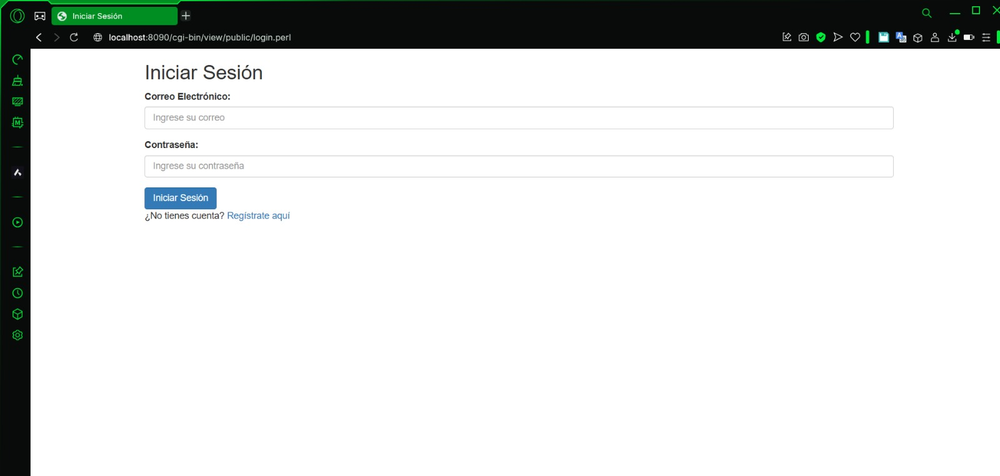
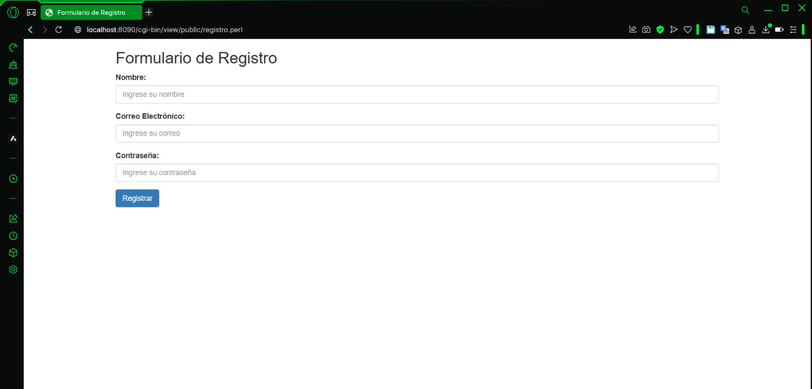
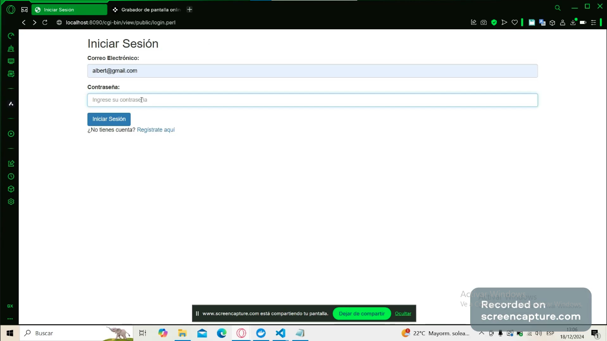
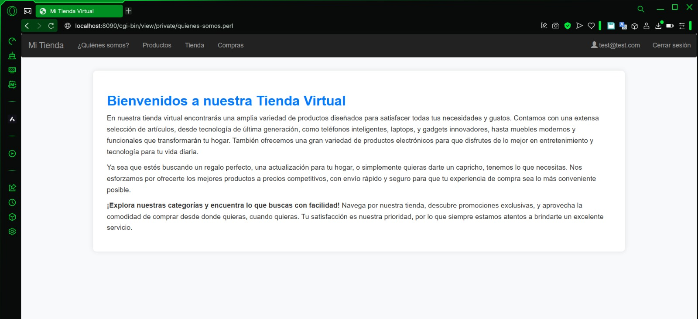
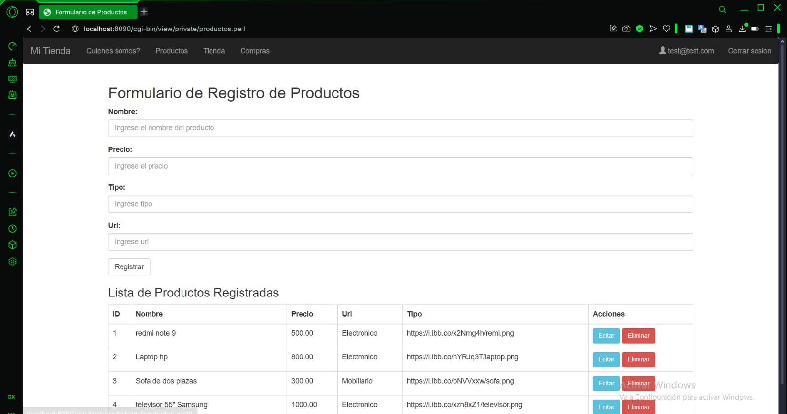
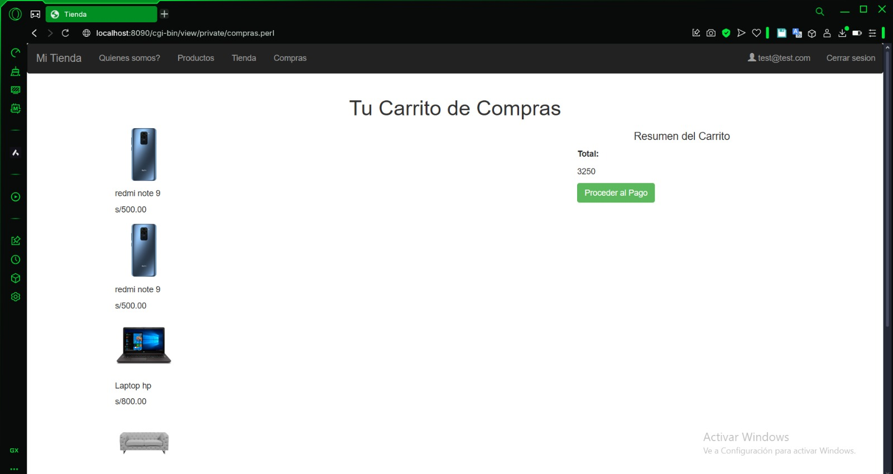
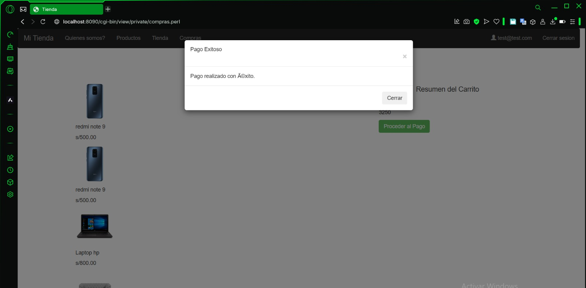

<div align="center">
<table>
    <theader>
        <tr>
            <td></td>
            <th>
                <span style="font-weight:bold;">UNIVERSIDAD NACIONAL DE SAN AGUSTIN</span><br />
                <span style="font-weight:bold;">FACULTAD DE INGENIERÍA DE PRODUCCIÓN Y SERVICIOS</span><br />
                <span style="font-weight:bold;">DEPARTAMENTO ACADÉMICO DE INGENIERÍA DE SISTEMAS E INFORMÁTICA</span><br />
                <span style="font-weight:bold;">ESCUELA PROFESIONAL DE INGENIERÍA DE SISTEMAS</span>
            </th>
            <td></td>
        </tr>
    </theader>
    <tbody>
        <tr><td colspan="3"><span style="font-weight:bold;">Formato</span>: Guía de Práctica de Laboratorio</td></tr>
        <tr><td><span style="font-weight:bold;">Aprobación</span>:  2022/03/01</td><td><span style="font-weight:bold;">Código</span>: GUIA-PRLD-001</td><td><span style="font-weight:bold;">Página</span>: 1</td></tr>
    </tbody>
</table>
</div>

<div align="center">
<span style="font-weight:bold;">PROYECTO</span><br />
</div>


<table>
<theader>
<tr><th colspan="6">INFORMACIÓN BÁSICA</th></tr>
</theader>
<tbody>
<tr><td>ASIGNATURA:</td><td colspan="5">Programación Web 1</td></tr>
<tr><td>TÍTULO DEL PROYECTO:</td><td colspan="5">Tienda Virtual</td></tr>
<tr>
<td>NÚMERO DE PRÁCTICA:</td><td></td><td>AÑO LECTIVO:</td><td>2024 B</td><td>NRO. SEMESTRE:</td><td>II</td>
</tr>
<tr>
<td>FECHA INICIO::</td><td>07-Dic-2024</td><td>FECHA FIN:</td><td>18-Dic-2024</td><td>DURACIÓN:</td><td>47 horas</td>
</tr>
<tr><td colspan="6">ESTUDIANTES:
    <ul>
	<h4>Mijael Paul Leon Ramos</h4>
        <h4>Limberg Sarmiento Tico</h4>        
        <h4>Christian Alexander Yana Huanca (Git-Hub)</h4>
    </ul>
</td>
</<tr>
<tr><td colspan="6">DOCENTES:
<ul>
<li>Richart Smith Escobedo Quispe - rescobedoq@unsa.edu.pe</li>
</ul>
</td>
</<tr>
</tdbody>
</table>

# EPISx

[![License][license]][license-file]
[![Downloads][downloads]][releases]
[![Last Commit][last-commit]][releases]

[![Debian][Debian]][debian-site]
[![Git][Git]][git-site]
[![GitHub][GitHub]][github-site]
[![Vim][Vim]][vim-site]
[![Java][Java]][java-site]

#

## OBJETIVOS TEMAS Y COMPETENCIAS

### OBJETIVOS

- Aplicar todo lo aprendido de la asignatura.

### TEMAS
- CRUD
- CGI
- HTML
- CSS
- AJAX
- JSON
- Git
- GitHub

## REPOSITORIO
repositorio en GitHub (Usamos el de Christian Alexander Yana Huanca)
- Creamos un nuevo proyecto en GitHub
    - https://github.com/ChristianAlexYana/Proyecto-PW.git
#

## Video Youtube Proyecto Final
- Se crea un solo video donde se muestra todas las funcionalidaes del proyecto
 - 00:00 [](https://www.youtube.com/watch?v=axf8S4xFhCI)
 - 00:48 [](https://youtu.be/axf8S4xFhCI?t=48)
 - 01:12 [](https://youtu.be/axf8S4xFhCI?t=72)
 - 01:40 [](https://youtu.be/axf8S4xFhCI?t=100)
 - 02:18 [](https://youtu.be/axf8S4xFhCI?t=139)
 - 03:37 [](https://youtu.be/axf8S4xFhCI?t=217)
 - 04:08 [](https://youtu.be/axf8S4xFhCI?t=248)

#

## PROCESO DEL PROYECTO
- crud-scripts/controller/compras/create.perl

Captura los parámetros email y producto_id enviados desde un formulario web utilizando el módulo CGI, y valida que ambos campos estén presentes. Si falta alguno, devuelve un mensaje de error en formato JSON. Luego, se conecta a una base de datos MariaDB usando DBI, prepara e intenta ejecutar una consulta SQL para insertar los datos en la tabla compras. Si la inserción es exitosa, responde con un mensaje de éxito en formato JSON, y si ocurre algún error durante la conexión o la ejecución, devuelve el error correspondiente. Finalmente, desconecta la base de datos.

```bash
 #!/usr/bin/perl
use strict;
use warnings;
use CGI;
use DBI;
use JSON;

# Crear un objeto CGI para manejar los datos del formulario
my $cgi = CGI->new();

# Capturar los parámetros enviados desde el formulario
my $email     = $cgi->param('email');
my $producto_id      = $cgi->param('producto_id');

# Imprimir el encabezado HTTP para devolver JSON
print $cgi->header('application/json;charset=UTF-8');

# Validar los datos de entrada
if (!$email || !$producto_id ) {
    print to_json({ error => "Todos los campos son obligatorios" });
    exit;
}

# Conectar a la base de datos
my $dsn = "DBI:MariaDB:database=datos;host=dbpets;port=3306";
my $user = "root";
my $password = "admin";

my $dbh = DBI->connect($dsn, $user, $password, { RaiseError => 1, AutoCommit => 1 });
if (!$dbh) {
    print to_json({ error => "Error al conectar a la base de datos: " . DBI->errstr });
    exit;
}

# Consulta SQL para insertar los datos
my $sql = 'INSERT INTO compras (email, producto_id) VALUES (?, ?)';
my $sth = $dbh->prepare($sql);
if (!$sth) {
    print to_json({ error => "Error al preparar la consulta: " . $dbh->errstr });
    $dbh->disconnect();
    exit;
}

# Ejecutar la consulta
eval {
    $sth->execute($email, $producto_id);
};

if ($@) {
    print to_json({ error => "Error durante la inserción: $@" });
} else {
    # Respuesta JSON de éxito
    # Enviar la respuesta JSON de éxito
print to_json({
    exito   => 1,  # Cambiar el campo a 'exito'
    mensaje => "Datos registrados exitosamente",
});

}

# Finalizar la declaración y desconectar
$sth->finish();
$dbh->disconnect();

```
- crud-scripts/controller/compras/read.perl

Conecta a una base de datos MariaDB, ejecuta una consulta SQL que selecciona información de las tablas compras y productos, y devuelve los resultados en formato JSON. La consulta obtiene los detalles de las compras, incluyendo el id, nombre, tipo, precio y url de los productos comprados. Los datos se almacenan en un array y se suman los precios de los productos. Finalmente, el script responde con un mensaje de éxito junto con los datos de los productos y la suma total de los precios, todo en formato JSON.

```bash
 #!/usr/bin/perl
use strict;
use warnings;
use CGI;
use DBI;
use JSON;

# Crear un objeto CGI para manejar los datos del formulario
my $cgi = CGI->new();

# Capturar los parámetros enviados desde el formulario
#my $name    = $cgi->param('name');

# Imprimir el encabezado HTTP para devolver JSON
print $cgi->header('application/json;charset=UTF-8');

# Conectar a la base de datos
my $dbh = DBI->connect("DBI:MariaDB:database=datos;host=dbpets;port=3306", 'root', 'admin', { RaiseError => 1, AutoCommit => 1 })
  or die to_json({ error => "Error al conectar a la base de datos: " . DBI->errstr });

# Consulta SQL para insertar los datos
my $sql = 'SELECT compras.id, productos.nombre, productos.tipo, productos.precio, productos.url from compras JOIN productos ON compras.producto_id = productos.id';
my $sth = $dbh->prepare($sql)
  or die to_json({ error => "Error al preparar la consulta: " . $dbh->errstr });

  

# Ejecutar la consulta
eval {
    $sth->execute()
      or die "Error al ejecutar la consulta: " . $sth->errstr;
};

if ($@) {
    print to_json({ error => "Error durante la inserción: $@" });
} else {

  my @productos;  # Array para los registros
my $suma_precio = 0;
while (my $row = $sth->fetchrow_hashref) {
    push @productos, {
        id     => $row->{id},
        nombre     => $row->{nombre},
        tipo => $row->{tipo},
        precio  => $row->{precio},
        url  => $row->{url},
};
$suma_precio += $row->{precio};
}

# Convertir el array a JSON
my $json = encode_json(\@productos);
    # Respuesta JSON de éxito
    print to_json({
        mensaje => "Datos leidos exitosamente",
        data    => \@productos,
	suma    => $suma_precio,
    });

}

# Finalizar la declaración y desconectar
$sth->finish();
$dbh->disconnect();
```
- crud-scripts/controller/login/auth.perl

Gestiona la autenticación de un usuario a través de un formulario web. Captura los parámetros email y contrasena, valida que ambos campos estén presentes y que el formato del correo electrónico sea correcto. Luego, se conecta a una base de datos MariaDB y verifica si las credenciales del usuario coinciden con los registros en la tabla usuarios. Si el usuario es autenticado correctamente, crea una sesión utilizando el módulo CGI::Session y establece una cookie de sesión. Si la autenticación falla, devuelve un mensaje de error. La respuesta se envía en formato JSON, incluyendo un mensaje y el estado de la autenticación.

```bash
#!/usr/bin/perl
use strict;
use warnings;
use CGI;
use CGI::Carp;
use CGI::Session;
use DBI;
use JSON;

my $cgi = CGI->new(); # create new CGI object

# Capturar los parámetros enviados desde el formulario
my $email      = $cgi->param('email');
my $contrasena = $cgi->param('contrasena');

# Validar los datos de entrada
if (!$email || !$contrasena) {
    print $cgi->header('application/json;charset=UTF-8');
    print to_json({ error => "Todos los campos son obligatorios" });
    exit;
}

# Validar que el email tenga un formato correcto
if ($email !~ /^[a-zA-Z0-9_.+-]+\@[a-zA-Z0-9-]+\.[a-zA-Z0-9-.]+$/) {
    print $cgi->header('application/json;charset=UTF-8');
    print to_json({ error => "El correo electrónico no es válido" });
    exit;
}

# Conectar a la base de datos
my $dsn = "DBI:MariaDB:database=datos;host=dbpets;port=3306";
my $user = "root";
my $password = "admin";

my $dbh = DBI->connect($dsn, $user, $password, { RaiseError => 1, AutoCommit => 1 });
if (!$dbh) {
    print $cgi->header('application/json;charset=UTF-8');
    print to_json({ error => "Error al conectar a la base de datos: " . DBI->errstr });
    exit;
}

# Consulta SQL
my $sql = 'SELECT * FROM usuarios WHERE email = ? AND contrasena = ?';
my $sth = $dbh->prepare($sql);

if (!$sth) {
    print $cgi->header('application/json;charset=UTF-8');
    print to_json({ error => "Error al preparar la consulta: " . $dbh->errstr });
    $dbh->disconnect();
    exit;
}

# Ejecutar la consulta
eval {
    $sth->execute($email, $contrasena);
};

if ($@) {
    print $cgi->header('application/json;charset=UTF-8');
    print to_json({ error => "Error durante la inserción: $@" });
    exit;
}

# Verificar si el usuario existe
my $row = $sth->fetchrow_hashref();
if ($row) {
    CGI::Session->name("PW1");
    my $session_id = $cgi->cookie('SESSION_ID') || undef;
    my $session = CGI::Session->new("driver:File", $session_id, {Directory => '/usr/local/apache2/cgi-bin/controller/tmp'});

    # Validar si la sesión se creó correctamente
    if (!$session) {
        print $cgi->header('application/json;charset=UTF-8');
        print to_json({ error => "No se pudo inicializar la sesión" });
        exit;
    }

    # Limpiar y configurar la sesión
    $session->clear(["_IS_LOGGED_IN"]);
    $session->expire(_IS_LOGGED_IN => '+10m');
    $session->param('_EMAIL', $email);
    $session->flush();

    my $cookie = $cgi->cookie(-name => 'SESSION_ID', -value => $session->id, -expires => '+10m');
    print $cgi->header(-type => 'application/json;charset=UTF-8', -cookie => $cookie);

    print to_json({
        status   => 'OK',
        mensaje  => "Usuario autentificado",
        email    => $email
    });
} else {
    print $cgi->header('application/json;charset=UTF-8');
    print to_json({
        status   => 'ERROR',
        mensaje  => "Usuario NO autentificado",
        email    => undef
    });
}

# Finalizar la declaración y desconectar
$sth->finish();
$dbh->disconnect();

```

- crud-scripts/controller/login/create.perl

Maneja el registro de un nuevo usuario a través de un formulario web. Captura los parámetros nombre, email y contrasena, valida que todos los campos estén presentes y que el formato del correo electrónico sea correcto. Luego, se conecta a una base de datos MariaDB y ejecuta una consulta SQL para insertar los datos del usuario en la tabla usuarios. Si la inserción es exitosa, responde con un mensaje en formato JSON indicando que los datos fueron registrados correctamente. Si ocurre un error en cualquiera de los pasos, se devuelve un mensaje de error en formato JSON.

```bash
#!/usr/bin/perl
use strict;
use warnings;
use CGI;
use DBI;
use JSON;

# Crear un objeto CGI para manejar los datos del formulario
my $cgi = CGI->new();

# Capturar los parámetros enviados desde el formulario
my $nombre     = $cgi->param('nombre');
my $email      = $cgi->param('email');
my $contrasena = $cgi->param('contrasena');

# Imprimir el encabezado HTTP para devolver JSON
print $cgi->header('application/json;charset=UTF-8');

# Validar los datos de entrada
if (!$nombre || !$email || !$contrasena) {
    print to_json({ error => "Todos los campos son obligatorios" });
    exit;
}

# Validar que el email tenga un formato correcto
if ($email !~ /^[a-zA-Z0-9_.+-]+\@[a-zA-Z0-9-]+\.[a-zA-Z0-9-.]+$/) {
    print to_json({ error => "El correo electrónico no es válido" });
    exit;
}

# Conectar a la base de datos
my $dsn = "DBI:MariaDB:database=datos;host=dbpets;port=3306";
my $user = "root";
my $password = "admin";

my $dbh = DBI->connect($dsn, $user, $password, { RaiseError => 1, AutoCommit => 1 });
if (!$dbh) {
    print to_json({ error => "Error al conectar a la base de datos: " . DBI->errstr });
    exit;
}

# Consulta SQL para insertar los datos
my $sql = 'INSERT INTO usuarios (nombre, email, contrasena) VALUES (?, ?, ?)';
my $sth = $dbh->prepare($sql);
if (!$sth) {
    print to_json({ error => "Error al preparar la consulta: " . $dbh->errstr });
    $dbh->disconnect();
    exit;
}

# Ejecutar la consulta
eval {
    $sth->execute($nombre, $email, $contrasena);
};

if ($@) {
    print to_json({ error => "Error durante la inserción: $@" });
} else {
    # Respuesta JSON de éxito
    # Enviar la respuesta JSON de éxito
print to_json({
    exito   => 1,  # Cambiar el campo a 'exito'
    mensaje => "Datos registrados exitosamente",
    nombre  => $nombre,
    email   => $email
});

}

# Finalizar la declaración y desconectar
$sth->finish();
$dbh->disconnect();

```
- crud-scripts/controller/productos/create.perl

Maneja el registro de un nuevo producto a través de un formulario web. Captura los parámetros nombre, tipo, precio y url, valida que los campos nombre, tipo y precio estén presentes. Luego, se conecta a una base de datos MariaDB y ejecuta una consulta SQL para insertar los datos del producto en la tabla productos. Si la inserción es exitosa, responde con un mensaje en formato JSON indicando que los datos fueron registrados correctamente. Si ocurre un error en alguno de los pasos, se devuelve un mensaje de error en formato JSON.

```bash
#!/usr/bin/perl
use strict;
use warnings;
use CGI;
use DBI;
use JSON;

# Crear un objeto CGI para manejar los datos del formulario
my $cgi = CGI->new();

# Capturar los parámetros enviados desde el formulario
my $nombre     = $cgi->param('nombre');
my $tipo      = $cgi->param('tipo');
my $precio = $cgi->param('precio');
my $url = $cgi->param('url');

# Imprimir el encabezado HTTP para devolver JSON
print $cgi->header('application/json;charset=UTF-8');

# Validar los datos de entrada
if (!$nombre || !$tipo || !$precio) {
    print to_json({ error => "Todos los campos son obligatorios" });
    exit;
}

# Conectar a la base de datos
my $dsn = "DBI:MariaDB:database=datos;host=dbpets;port=3306";
my $user = "root";
my $password = "admin";

my $dbh = DBI->connect($dsn, $user, $password, { RaiseError => 1, AutoCommit => 1 });
if (!$dbh) {
    print to_json({ error => "Error al conectar a la base de datos: " . DBI->errstr });
    exit;
}

# Consulta SQL para insertar los datos
my $sql = 'INSERT INTO productos (nombre, tipo, precio, url) VALUES (?, ?, ?, ?)';
my $sth = $dbh->prepare($sql);
if (!$sth) {
    print to_json({ error => "Error al preparar la consulta: " . $dbh->errstr });
    $dbh->disconnect();
    exit;
}

# Ejecutar la consulta
eval {
    $sth->execute($nombre, $tipo, $precio, $url);
};

if ($@) {
    print to_json({ error => "Error durante la inserción: $@" });
} else {
    # Respuesta JSON de éxito
    # Enviar la respuesta JSON de éxito
print to_json({
    exito   => 1,  # Cambiar el campo a 'exito'
    mensaje => "Datos registrados exitosamente",
    nombre  => $nombre,
    tipo   => $tipo
});

}

# Finalizar la declaración y desconectar
$sth->finish();
$dbh->disconnect();

```
- crud-scripts/controller/productos/delete.perl

Recibe un parámetro id a través de un formulario CGI. Conecta a una base de datos MariaDB, prepara y ejecuta una consulta SQL para eliminar un registro de la tabla productos cuyo id coincida con el proporcionado. Si ocurre algún error en la ejecución, devuelve un mensaje de error en formato JSON. Si la operación es exitosa, responde con un mensaje de éxito y el id del registro eliminado en formato JSON.

```bash
#!/usr/bin/perl
use strict;
use warnings;
use CGI;
use DBI;
use JSON;

# Crear un objeto CGI para manejar los datos del formulario
my $cgi = CGI->new();

# Capturar los parámetros enviados desde el formulario
my $id    = $cgi->param('id');


# Imprimir el encabezado HTTP para devolver JSON
print $cgi->header('application/json;charset=UTF-8');

# Conectar a la base de datos
my $dbh = DBI->connect("DBI:MariaDB:database=datos;host=dbpets;port=3306", 'root', 'admin', { RaiseError => 1, AutoCommit => 1 })
  or die to_json({ error => "Error al conectar a la base de datos: " . DBI->errstr });

# Consulta SQL para insertar los datos
my $sql = 'DELETE FROM productos WHERE id = ?';
my $sth = $dbh->prepare($sql)
  or die to_json({ error => "Error al preparar la consulta: " . $dbh->errstr });

# Ejecutar la consulta
eval {
    $sth->execute($id)
      or die "Error al ejecutar la consulta: " . $sth->errstr;
};

if ($@) {
    print to_json({ error => "Error durante la inserción: $@" });
} else {
    # Respuesta JSON de éxito
    print to_json({
        id => $id,
        mensaje => "Dato eliminado exitosamente",
        
    });
}

# Finalizar la declaración y desconectar
$sth->finish();
$dbh->disconnect();
```

- crud-scripts/controller/productos/findbyd.perl

Maneja la consulta de un producto en la base de datos a través de un formulario web. Captura el parámetro id enviado desde el formulario, se conecta a una base de datos MariaDB y ejecuta una consulta SQL para obtener los detalles del producto con el ID especificado. Si el producto existe, devuelve los datos del producto en formato JSON. Si no se encuentra el producto o ocurre un error en cualquiera de los pasos, devuelve un mensaje de error en formato JSON.

```bash
#!/usr/bin/perl
use strict;
use warnings;
use CGI;
use DBI;
use JSON;

# Crear un objeto CGI para manejar los datos del formulario
my $cgi = CGI->new();

# Capturar los parámetros enviados desde el formulario
my $id    = $cgi->param('id');

# Imprimir el encabezado HTTP para devolver JSON
print $cgi->header('application/json;charset=UTF-8');

# Conectar a la base de datos
my $dbh = DBI->connect("DBI:MariaDB:database=datos;host=dbpets;port=3306", 'root', 'admin', { RaiseError => 1, AutoCommit => 1 })
  or die to_json({ error => "Error al conectar a la base de datos: " . DBI->errstr });

# Consulta SQL para insertar los datos
my $sql = 'SELECT * from productos WHERE id = ?';
my $sth = $dbh->prepare($sql)
  or die to_json({ error => "Error al preparar la consulta: " . $dbh->errstr });

  

# Ejecutar la consulta
eval {
    $sth->execute($id)
      or die "Error al ejecutar la consulta: " . $sth->errstr;
};

my $row = $sth->fetchrow_hashref();

if ($@) {
    print to_json({ error => "Error durante la inserción: $@" });
} else {

if ($row) {
    print to_json({
        id => $row->{id},
        nombre => $row->{nombre},
        tipo => $row->{tipo},
        precio => $row->{precio},
        url => $row->{url},
    });
} else {
    print to_json({ error => "Producto no encontrada" });
}
}

# Finalizar la declaración y desconectar
$sth->finish();
$dbh->disconnect();
```

- crud-scripts/controller/productos/read.perl

Consulta todos los productos de una base de datos MariaDB y devuelve los resultados en formato JSON. Se conecta a la base de datos, ejecuta una consulta SQL para obtener todos los productos de la tabla productos, y luego almacena los datos (como id, nombre, tipo, precio y url) en un array. Si la consulta es exitosa, devuelve los productos en formato JSON con un mensaje de éxito.


```bash
#!/usr/bin/perl
use strict;
use warnings;
use CGI;
use DBI;
use JSON;

# Crear un objeto CGI para manejar los datos del formulario
my $cgi = CGI->new();

# Imprimir el encabezado HTTP para devolver JSON
print $cgi->header('application/json;charset=UTF-8');

# Conectar a la base de datos
my $dbh = DBI->connect("DBI:MariaDB:database=datos;host=dbpets;port=3306", 'root', 'admin', { RaiseError => 1, AutoCommit => 1 })
  or die encode_json({ error => "Error al conectar a la base de datos: " . DBI->errstr });

# Consulta SQL para obtener los datos
my $sql = 'SELECT * from productos';
my $sth = $dbh->prepare($sql)
  or die encode_json({ error => "Error al preparar la consulta: " . $dbh->errstr });

# Ejecutar la consulta
eval {
    $sth->execute()
      or die "Error al ejecutar la consulta: " . $sth->errstr;
};

if ($@) {
    print encode_json({ error => "Error durante la consulta: $@" });
} else {
    my @productos;  # Array para los registros
    while (my $row = $sth->fetchrow_hashref) {
        push @productos, {
            id     => $row->{id},
            nombre => $row->{nombre},
            tipo   => $row->{tipo},
            precio => $row->{precio},
            url => $row->{url},
        };
    }

    # Convertir el array de productos a JSON y enviarlo como respuesta
    print encode_json({
        mensaje => "Datos leídos exitosamente",
        data    => \@productos,
    });
}

# Finalizar la declaración y desconectar
$sth->finish();
$dbh->disconnect();

```

- crud-scripts/controller/productos/update.perl

Actualiza los datos de un producto en una base de datos MariaDB. Captura los parámetros id, nombre, tipo, precio y url enviados desde un formulario web, se conecta a la base de datos y ejecuta una consulta SQL para actualizar el producto correspondiente al id especificado. Si la actualización es exitosa, devuelve un mensaje en formato JSON con los nuevos datos del producto. Si ocurre algún error durante el proceso, se devuelve un mensaje de error en formato JSON.

```bash

#!/usr/bin/perl
use strict;
use warnings;
use CGI;
use DBI;
use JSON;

# Crear un objeto CGI para manejar los datos del formulario
my $cgi = CGI->new();

# Capturar los parámetros enviados desde el formulario
my $id    = $cgi->param('id');
my $nombre    = $cgi->param('nombre');
my $tipo   = $cgi->param('tipo');
my $precio = $cgi->param('precio');
my $url = $cgi->param('url');

# Imprimir el encabezado HTTP para devolver JSON
print $cgi->header('application/json;charset=UTF-8');

# Conectar a la base de datos
my $dbh = DBI->connect("DBI:MariaDB:database=datos;host=dbpets;port=3306", 'root', 'admin', { RaiseError => 1, AutoCommit => 1 })
  or die to_json({ error => "Error al conectar a la base de datos: " . DBI->errstr });

# Consulta SQL para insertar los datos
my $sql = 'UPDATE productos SET nombre = ?, tipo = ?, precio = ?, url = ? WHERE id = ?';
my $sth = $dbh->prepare($sql)
  or die to_json({ error => "Error al preparar la consulta: " . $dbh->errstr });

# Ejecutar la consulta
eval {
    $sth->execute($nombre, $tipo, $precio, $url, $id)
      or die "Error al ejecutar la consulta: " . $sth->errstr;
};

if ($@) {
    print to_json({ error => "Error durante la inserción: $@" });
} else {
    # Respuesta JSON de éxito
    print to_json({
        mensaje => "Datos actualizados exitosamente",
        id => $id,
        nombre    => $nombre,
        precio    => $precio,
        tipo    => $tipo,
        url    => $url,
    });
}

# Finalizar la declaración y desconectar
$sth->finish();
$dbh->disconnect();

```

- crud-scripts/controller/view/private/compras.perl

Autentifica a los usuarios mediante sesiones. Verifica si el usuario está logueado; si no lo está, redirige a la página de inicio de sesión. Si el usuario está logueado, muestra la interfaz de la tienda con el correo del usuario en el encabezado y un carrito de compras. El código permite al usuario cerrar sesión, lo que borra la sesión y lo redirige al inicio de sesión. Además, incluye una funcionalidad para cargar dinámicamente el contenido del carrito de compras a través de una llamada AJAX a un script Perl, mostrando los productos, el total y un botón para proceder al pago. Al hacer clic en el botón de pago, muestra un modal de éxito.

```bash
#!/usr/bin/perl
use strict;
use warnings;
use CGI;
use CGI::Session;

# Crear el objeto CGI
my $cgi = CGI->new();

# Crear una nueva sesión o recuperar la sesión existente
my $session = CGI::Session->load("driver:File", $cgi->cookie('SESSION_ID') || undef , {Directory => '/usr/local/apache2/cgi-bin/controller/tmp'});

# Verificar si el parámetro 'logout' fue enviado (botón de cerrar sesión)
#

if (!$session || !$session->param('_EMAIL')) {
    # Si la sesión ha expirado o está vacía, destruirla y redirigir al login
    print $cgi->redirect(-uri => '/cgi-bin/view/public/login.perl');
    exit;
}

if ($session->is_expired || $session->is_empty) {
    # Si la sesión ha expirado o está vacía, destruirla y redirigir al login
    $session->delete();
    $session->flush();
    print $cgi->redirect(-uri => '/cgi-bin/view/public/login.perl');
    exit;
}


if ($cgi->param('logout')) {
    # Borrar la sesión y redirigir a la página principal
    $session->delete();
    $session->flush();
    my $cookie = $cgi->cookie(-name => 'SESSION_ID', -value => '', -expires => '-1d');
    print $cgi->redirect(-uri => '/cgi-bin/view/public/login.perl', -cookie => $cookie);
    exit;
}

# Verificar si el parámetro '_EMAIL' está presente en la sesión
if ($session->param('_EMAIL')) {
    # Si el usuario está logueado, mostrar la tienda con el correo en el header
    my $email = $session->param('_EMAIL');
    print $cgi->header('text/html');
    print <<HTML;
<!DOCTYPE html>
<html lang="es">
<head>
    <meta charset="UTF-8">
    <meta name="viewport" content="width=device-width, initial-scale=1.0">
    <title>Tienda</title>
    <link rel="stylesheet" href="https://maxcdn.bootstrapcdn.com/bootstrap/3.3.7/css/bootstrap.min.css">
    <script src="https://ajax.googleapis.com/ajax/libs/jquery/3.3.1/jquery.min.js"></script>
    <script src="https://maxcdn.bootstrapcdn.com/bootstrap/3.3.7/js/bootstrap.min.js"></script>
</head>
<body>
    <nav class="navbar navbar-inverse">
        <div class="container-fluid">
            <div class="navbar-header">
                <a class="navbar-brand" href="#">Mi Tienda</a>
            </div>
	    <ul class="nav navbar-nav">
                <li><a href="quienes-somos.perl">Quienes somos?</a></li>
                <li><a href="productos.perl">Productos</a></li>
                <li><a href="tienda.perl">Tienda</a></li>
                <li><a href="compras.perl">Compras</a></li>
            </ul>
            <ul class="nav navbar-nav navbar-right">
                <li><a href="#"><span class="glyphicon glyphicon-user"></span> $email</a></li>
                <li>
                    <form method="post" style="display:inline;">
                        <button type="submit" name="logout" class="btn btn-link navbar-btn">Cerrar sesion</button>
                    </form>
                </li>
            </ul>
        </div>
    </nav>
    <div class="container">
    <h1 class="text-center">Tu Carrito de Compras</h1>

    <div class="row">
        <div class="col-md-8">

        <div id="table-container">
            <!-- Aquí se insertará la tabla dinámicamente -->
        </div>
        </div>

        <div class="col-md-4">
            <div class="border p-3">
                <h4 class="text-center">Resumen del Carrito</h4>
                <p><strong>Total:</strong> <p id="total-container"></p></p>
                <button class="btn btn-success w-100" id="proceed-payment">Proceder al Pago</button>
            </div>
        </div>
		
	<div class="modal fade" id="paymentModal" tabindex="-1" role="dialog" aria-labelledby="paymentModalLabel" aria-hidden="true">
    <div class="modal-dialog" role="document">
        <div class="modal-content">
            <div class="modal-header">
                <h5 class="modal-title" id="paymentModalLabel">Pago Exitoso</h5>
                <button type="button" class="close" data-dismiss="modal" aria-label="Close">
                    <span aria-hidden="true">&times;</span>
                </button>
            </div>
            <div class="modal-body">
                Pago realizado con éxito.
            </div>
            <div class="modal-footer">
                <button type="button" class="btn btn-secondary" data-dismiss="modal">Cerrar</button>
            </div>
        </div>
    </div>
</div>
    </div>
    </div>

    <script>
    document.getElementById("proceed-payment").addEventListener("click", function() {
        // Muestra el mensaje de éxito y oculta el botón
	        \$('#paymentModal').modal('show');
    });
		\$(document).ready(function() {
			function cargarTabla() {
				\$.ajax({
					url: "/cgi-bin/controller/compras/read.perl", // Archivo Perl que devuelve los registros en formato JSON
					type: "GET",
					dataType: "json"
				})
				.done(function(dataset) {
					// Generar tabla dinámica
					let table = "";
					console.log(dataset.data);
					dataset.data.forEach(function(record) {
					table += "<div class='cart-item'><div class='row'>"
					table += "<div class='col-2'></div>"
					table += "<div class='col-6'><h5>"+record.nombre+"</h5></div>"
					table += "<div class='col-2'><p>s/"+record.precio+"</p></div>"
					table += "</div></div>"
					});
					let preciototal = ""+dataset.suma;

					// Insertar la tabla en el contenedor
					\$("#table-container").html(table);
					\$("#total-container").html(preciototal);
					\$(".comprarBtn").on('click', function() {
						let id = \$(this).data('id');


					var dt = {
						email: '$email',
						producto_id: id,
					};
					var request = \$.ajax({
						url: "/cgi-bin/controller/compras/create.perl",
						type: "POST",
						data: dt,
						dataType: "json"
					});
					request.done(function(dataset) {
						\$('#respAjax').addClass("well");
						\$('#respAjax').html("Datos enviados correctamente: " + JSON.stringify(dataset));
						cargarTabla();
					});
					request.fail(function(jqXHR, textStatus) {
						alert("Error en la solicitud: " + textStatus);
					});


					});
					\$(".deleteBtn").on('click', function() {
						let id = \$(this).data('id');
<<<<<<< HEAD
						eliminarMascota(id);
=======
						eliminarProducto(id);
>>>>>>> LimbergSarmiento
					});
				})
				.fail(function(jqXHR, textStatus) {
					\$("#table-container").html("<div class='alert alert-danger'>Error al cargar los datos: " + textStatus + "</div>");
				});
			}

			cargarTabla();
			})
    </script>
</body>
</html>
HTML
} else {
    # Si el usuario no está logueado, mostrar mensaje de no logueado
    print $cgi->header('text/html');
    print <<HTML;
<!DOCTYPE html>
<html lang="es">
<head>
    <meta charset="UTF-8">
    <meta name="viewport" content="width=device-width, initial-scale=1.0">
    <title>No logueado</title>
    <link rel="stylesheet" href="https://maxcdn.bootstrapcdn.com/bootstrap/3.3.7/css/bootstrap.min.css">
</head>
<body>
    <div class="container">
        <h1>No estás logueado</h1>
        <p><a href="login.pl" class="btn btn-primary">Iniciar sesión</a></p>
    </div>
</body>
</html>
HTML
}
```

- crud-scripts/controller/view/private/productos.perl

Gestiona productos en una tienda online. Verifica la autenticación del usuario mediante sesiones, mostrando un formulario para registrar productos y una tabla dinámica que se actualiza con datos obtenidos a través de AJAX. Los productos se pueden editar o eliminar mediante modales y botones interactivos. 

```bash
#!/usr/bin/perl
use strict;
use warnings;

use CGI;
use CGI::Session;

# Crear el objeto CGI
my $cgi = CGI->new();

# Crear una nueva sesión o recuperar la sesión existente
my $session = CGI::Session->load("driver:File", $cgi->cookie('SESSION_ID') || undef , {Directory => '/usr/local/apache2/cgi-bin/controller/tmp'});

# Verificar si el parámetro 'logout' fue enviado (botón de cerrar sesión)
#

if (!$session || !$session->param('_EMAIL')) {
    # Si la sesión ha expirado o está vacía, destruirla y redirigir al login
    print $cgi->redirect(-uri => '/cgi-bin/view/public/login.perl');
    exit;
}

if ($session->is_expired || $session->is_empty) {
    # Si la sesión ha expirado o está vacía, destruirla y redirigir al login
    $session->delete();
    $session->flush();
    print $cgi->redirect(-uri => '/cgi-bin/view/public/login.perl');
    exit;
}


if ($cgi->param('logout')) {
    # Borrar la sesión y redirigir a la página principal
    $session->delete();
    $session->flush();
    my $cookie = $cgi->cookie(-name => 'SESSION_ID', -value => '', -expires => '-1d');
    print $cgi->redirect(-uri => '/cgi-bin/view/public/login.perl', -cookie => $cookie);
    exit;
}


my $email = $session->param('_EMAIL');
# Imprimir cabecera HTTP válida
print "Content-type: text/html\n\n";

print <<EOF;
<!DOCTYPE html>
<html lang="es">
<head>
    <title>Formulario de Productos</title>
    <meta charset="utf-8">
    <meta name="viewport" content="width=device-width, initial-scale=1">
    <link rel="stylesheet" href="https://maxcdn.bootstrapcdn.com/bootstrap/3.3.7/css/bootstrap.min.css">
    <script src="https://ajax.googleapis.com/ajax/libs/jquery/3.3.1/jquery.min.js"></script>
    <script src="https://maxcdn.bootstrapcdn.com/bootstrap/3.3.7/js/bootstrap.min.js"></script>
</head>
<body>
    <nav class="navbar navbar-inverse">
        <div class="container-fluid">
            <div class="navbar-header">
                <a class="navbar-brand" href="#">Mi Tienda</a>
            </div>
	    <ul class="nav navbar-nav">
                <li><a href="quienes-somos.perl">Quienes somos?</a></li>
                <li><a href="productos.perl">Productos</a></li>
                <li><a href="tienda.perl">Tienda</a></li>
                <li><a href="compras.perl">Compras</a></li>
            </ul>
            <ul class="nav navbar-nav navbar-right">
                <li><a href="#"><span class="glyphicon glyphicon-user"></span> $email</a></li>
                <li>
                    <form method="post" style="display:inline;">
                        <button type="submit" name="logout" class="btn btn-link navbar-btn">Cerrar sesion</button>
                    </form>
                </li>
            </ul>
        </div>
    </nav>
    <div class="container">
        <h2>Formulario de Registro de Productos</h2>
        <form action="myscript.perl">
            <div class="form-group">
                <label for="nombre">Nombre:</label>
<<<<<<< HEAD
                <input type="text" class="form-control" id="nombre" placeholder="Ingrese el nombre de la mascota" name="nombre">
            </div>
            <div class="form-group">
                <label for="precio">Precio:</label>
                <input type="text" class="form-control" id="precio" placeholder="Ingrese el nombre del propietario" name="precio">
=======
                <input type="text" class="form-control" id="nombre" placeholder="Ingrese el nombre del producto" name="nombre">
            </div>
            <div class="form-group">
                <label for="precio">Precio:</label>
                <input type="text" class="form-control" id="precio" placeholder="Ingrese el precio" name="precio">
>>>>>>> LimbergSarmiento
            </div>
            <div class="form-group">
                <label for="tipo">Tipo:</label>
                <input type="text" class="form-control" id="tipo" placeholder="Ingrese tipo" name="tipo">
            </div>
            <div class="form-group">
                <label for="url">Url:</label>
                <input type="text" class="form-control" id="url" placeholder="Ingrese url" name="url">
            </div>
            <div class="form-group">
                <div id="respAjax" class=""></div>
            </div>
            <button id="submitAJAX" class="btn_submit btn btn-default">Registrar</button>
        </form>
        <h3>Lista de Productos Registradas</h3>
        <div id="table-container">
            <!-- Aquí se insertará la tabla dinámicamente -->
        </div>
        <div id="editModal" class="modal fade" role="dialog">
            <div class="modal-dialog">
                <div class="modal-content">
                    <div class="modal-header">
                        <button type="button" class="close" data-dismiss="modal">&times;</button>
                        <h4 class="modal-title">Editar Producto</h4>
                    </div>
                    <div class="modal-body">
                        <form id="editForm">
                            <div class="form-group">
                                <label for="editNombre">Nombre:</label>
                                <input type="text" class="form-control" id="editNombre" name="nombre">
                            </div>
                            <div class="form-group">
                                <label for="editPrecio">Precio:</label>
                                <input type="text" class="form-control" id="editPrecio" name="precio">
                            </div>
                            <div class="form-group">
                                <label for="editTipo">Tipo:</label>
                                <input type="text" class="form-control" id="editTipo" name="tipo">
                            </div>
                            <div class="form-group">
                                <label for="editUrl">Url:</label>
                                <input type="text" class="form-control" id="editUrl" name="url">
                            </div>
                            <button type="submit" class="btn btn-primary">Guardar Cambios</button>
                        </form>
                    </div>
                    <div class="modal-footer">
                        <button type="button" class="btn btn-default" data-dismiss="modal">Cerrar</button>
                    </div>
                </div>
            </div>
        </div>
    </div>
	<script>
		\$(document).ready(function() {
			function cargarTabla() {
				\$.ajax({
					url: "/cgi-bin/controller/productos/read.perl", // Archivo Perl que devuelve los registros en formato JSON
					type: "GET",
					dataType: "json"
				})
				.done(function(dataset) {
					// Generar tabla dinámica
					let table = "<table class='table table-bordered'><thead><tr><th>ID</th><th>Nombre</th><th>Precio</th><th>Url</th><th>Tipo</th><th>Acciones</th></tr></thead><tbody>";
					console.log(dataset.data);
					dataset.data.forEach(function(record) {
						console.log(record.id);
						table += "<tr>";
						table += "<td>"+record.id+"</td>";
						table += "<td>"+record.nombre+"</td>";
						table += "<td>"+record.precio+"</td>";
						table += "<td>"+record.tipo+"</td>";
						table += "<td>"+record.url+"</td>";
						table += "<td><button class='btn btn-info btn-sm editBtn' data-id='" + record.id + "'>Editar</button>";
						table += " <button class='btn btn-danger btn-sm deleteBtn' data-id='" + record.id + "'>Eliminar</button></td>";
						table += "</tr>";
					});
					table += "</tbody></table>";

					// Insertar la tabla en el contenedor
					\$("#table-container").html(table);
					\$(".editBtn").on('click', function() {
						console.log("hola");
						let id = \$(this).data('id');
						let nombre = \$(this).data('nombre');
						console.log(nombre);

<<<<<<< HEAD
						editarMascota(id);
					});
					\$(".deleteBtn").on('click', function() {
						let id = \$(this).data('id');
						eliminarMascota(id);
=======
						editarProducto(id);
					});
					\$(".deleteBtn").on('click', function() {
						let id = \$(this).data('id');
						eliminarProducto(id);
>>>>>>> LimbergSarmiento
					});
				})
				.fail(function(jqXHR, textStatus) {
					\$("#table-container").html("<div class='alert alert-danger'>Error al cargar los datos: " + textStatus + "</div>");
				});
			}

			cargarTabla();

			// Crear
			\$('.btn_submit').on('click', function(e) {
				var objectEvent = \$(this);
				if (objectEvent.attr('id') === 'submitNoAJAX') {
					\$('form').attr('action', 'myscript.perl');
					return true;
				}
				e.preventDefault();
				if (objectEvent.attr('id') === 'submitAJAX') {
					var dt = {
						nombre: \$("#nombre").val(),
						precio: \$("#precio").val(),
						tipo: \$("#tipo").val(),
						url: \$("#url").val(),
					};
					var request = \$.ajax({
						url: "/cgi-bin/controller/productos/create.perl",
						type: "POST",
						data: dt,
						dataType: "json"
					});
					request.done(function(dataset) {
						\$('#respAjax').addClass("well");
						\$('#respAjax').html("Datos enviados correctamente: " + JSON.stringify(dataset));
						cargarTabla();
					});
					request.fail(function(jqXHR, textStatus) {
						alert("Error en la solicitud: " + textStatus);
					});
				}
			});

			// actualizar
			\$('#editForm').on('submit', function(e) {
				e.preventDefault(); // Evitar el comportamiento por defecto del formulario

				// Recoger los datos del formulario
				var formData = {
<<<<<<< HEAD
					id: \$('#editForm').data('id'), // Obtener el id de la mascota a editar
=======
					id: \$('#editForm').data('id'), // Obtener el id del producto a editar
>>>>>>> LimbergSarmiento
					nombre: \$('#editNombre').val(),
					precio: \$('#editPrecio').val(),
					tipo: \$('#editTipo').val(),
					url: \$('#editUrl').val(),
				};

				// Enviar la solicitud AJAX para actualizar los datos
				\$.ajax({
<<<<<<< HEAD
					url: "/cgi-bin/controller/productos/update.perl", // Archivo Perl que actualiza la mascota en la base de datos
=======
					url: "/cgi-bin/controller/productos/update.perl", // Archivo Perl que actualiza el producto en la base de datos
>>>>>>> LimbergSarmiento
					type: "POST",
					data: formData,
					dataType: "json",
					success: function(response) {
						if (response.error) {
							alert("Error: " + response.error);
						} else {
							// Cerrar el modal y recargar la tabla
							\$('#editModal').modal('hide');
							cargarTabla();
						}
					},
					error: function(jqXHR, textStatus) {
						alert("Error en la solicitud: " + textStatus);
					}
				});
			});

			// eliminar
<<<<<<< HEAD
			function eliminarMascota(id) {
				console.log("id", id);
				if (confirm("¿Estás seguro de que deseas eliminar esta mascota?")) {
=======
			function eliminarProducto(id) {
				console.log("id", id);
				if (confirm("¿Estás seguro de que deseas eliminar esta producto?")) {
>>>>>>> LimbergSarmiento
					var request = \$.ajax({
						url: "/cgi-bin/controller/productos/delete.perl", // El archivo Perl para eliminar un registro
						type: "POST",
						data: { id: id },
						dataType: "json",
					});
					request.done(function() {
						\$('#respAjax').addClass("well");
						\$('#respAjax').html("Dato eliminado");
						cargarTabla();
					});
					request.fail(function(jqXHR, textStatus) {
						alert("Error en la solicitud: " + textStatus);
					});
				}
			}

			// abrir modal
<<<<<<< HEAD
			function editarMascota(id) {
				// Hacer una solicitud para obtener los datos de la mascota
				\$.ajax({
					url: "/cgi-bin/controller/productos/findbyid.perl", // Un script que devolverá los datos de la mascota en formato JSON
=======
			function editarProducto(id) {
				// Hacer una solicitud para obtener los datos del producto
				\$.ajax({
					url: "/cgi-bin/controller/productos/findbyid.perl", // Un script que devolverá los datos del producto en formato JSON
>>>>>>> LimbergSarmiento
					type: "GET",
					data: { id: id },
					dataType: "json",
					success: function(data) {
						if (data.error) {
							alert("Error: " + data.error);
						} else {
<<<<<<< HEAD
							// Rellenar los campos del modal con los datos de la mascota
=======
							// Rellenar los campos del modal con los datos del producto
>>>>>>> LimbergSarmiento
							\$('#editNombre').val(data.nombre);
							\$('#editPrecio').val(data.precio);
							\$('#editTipo').val(data.tipo);
							\$('#editUrl').val(data.url);
							\$('#editForm').data('id', id); // Guardar el id en el formulario

							// Mostrar el modal
							\$('#editModal').modal('show');
						}
					},
					error: function(jqXHR, textStatus) {
						alert("Error al obtener los datos: " + textStatus);
					}
				});
			}

			
		});
	</script>
</body>
</html>

EOF
<<<<<<< HEAD
=======

>>>>>>> LimbergSarmiento
```

- crud-scripts/controller/view/private/quienes-somos.perl.perl

Si el usuario está autenticado, se muestra una página con información sobre la tienda y un menú de navegación, incluyendo su correo electrónico y un botón para cerrar sesión. Si el usuario no está logueado, se muestra un mensaje indicándole que debe iniciar sesión. También incluye medidas para manejar la expiración de la sesión y redirigir al login en caso de que sea necesario.

```bash
#!/usr/bin/perl
use strict;
use warnings;
use CGI;
use CGI::Session;

# Crear el objeto CGI
my $cgi = CGI->new();

# Crear una nueva sesión o recuperar la sesión existente
my $session = CGI::Session->load("driver:File", $cgi->cookie('SESSION_ID') || undef , {Directory => '/usr/local/apache2/cgi-bin/controller/tmp'});

# Verificar si el parámetro 'logout' fue enviado (botón de cerrar sesión)
#

if (!$session || !$session->param('_EMAIL')) {
    # Si la sesión ha expirado o está vacía, destruirla y redirigir al login
    print $cgi->redirect(-uri => '/cgi-bin/view/public/login.perl');
    exit;
}

if ($session->is_expired || $session->is_empty) {
    # Si la sesión ha expirado o está vacía, destruirla y redirigir al login
    $session->delete();
    $session->flush();
    print $cgi->redirect(-uri => '/cgi-bin/view/public/login.perl');
    exit;
}


if ($cgi->param('logout')) {
    # Borrar la sesión y redirigir a la página principal
    $session->delete();
    $session->flush();
    my $cookie = $cgi->cookie(-name => 'SESSION_ID', -value => '', -expires => '-1d');
    print $cgi->redirect(-uri => '/cgi-bin/view/public/login.perl', -cookie => $cookie);
    exit;
}

# Verificar si el parámetro '_EMAIL' está presente en la sesión
if ($session->param('_EMAIL')) {
    # Si el usuario está logueado, mostrar la tienda con el correo en el header
    my $email = $session->param('_EMAIL');
    print $cgi->header(
	    -type => 'text/html; charset=UTF-8', 
	    -charset => 'UTF-8'
    );
    print <<HTML;
<!DOCTYPE html>
<html lang="es">
<head>
    <meta charset="UTF-8">
    <meta name="viewport" content="width=device-width, initial-scale=1.0">
    <title>Mi Tienda Virtual</title>
    <link rel="stylesheet" href="https://maxcdn.bootstrapcdn.com/bootstrap/3.3.7/css/bootstrap.min.css">
    <script src="https://ajax.googleapis.com/ajax/libs/jquery/3.3.1/jquery.min.js"></script>
    <script src="https://maxcdn.bootstrapcdn.com/bootstrap/3.3.7/js/bootstrap.min.js"></script>
    <style>
        body {
            background-color: #f8f9fa;
            font-family: 'Arial', sans-serif;
        }
        .navbar {
            margin-bottom: 30px;
        }
        .container {
            background-color: #ffffff;
            padding: 30px;
            box-shadow: 0 0 10px rgba(0, 0, 0, 0.1);
            border-radius: 8px;
        }
        h2 {
            color: #007bff;
            font-weight: bold;
        }
        p {
            font-size: 1.1em;
            line-height: 1.6;
        }
        .btn-primary {
            background-color: #007bff;
            border-color: #007bff;
        }
        .btn-primary:hover {
            background-color: #0056b3;
            border-color: #0056b3;
        }
    </style>
</head>
<body>
    <nav class="navbar navbar-inverse">
        <div class="container-fluid">
            <div class="navbar-header">
                <a class="navbar-brand" href="#">Mi Tienda</a>
            </div>
            <ul class="nav navbar-nav">
                <li><a href="quienes-somos.perl">¿Quiénes somos?</a></li>
                <li><a href="productos.perl">Productos</a></li>
                <li><a href="tienda.perl">Tienda</a></li>
                <li><a href="compras.perl">Compras</a></li>
            </ul>
            <ul class="nav navbar-nav navbar-right">
                <li><a href="#"><span class="glyphicon glyphicon-user"></span> $email</a></li>
                <li>
                    <form method="post" style="display:inline;">
                        <button type="submit" name="logout" class="btn btn-link navbar-btn">Cerrar sesión</button>
                    </form>
                </li>
            </ul>
        </div>
    </nav>

    <div class="container">
        <h2>Bienvenidos a nuestra Tienda Virtual</h2>
        <p>En nuestra tienda virtual encontrarás una amplia variedad de productos diseñados para satisfacer todas tus necesidades y gustos. Contamos con una extensa selección de artículos, desde tecnología de última generación, como teléfonos inteligentes, laptops, y gadgets innovadores, hasta muebles modernos y funcionales que transformarán tu hogar. También ofrecemos una gran variedad de productos electrónicos para que disfrutes de lo mejor en entretenimiento y tecnología para tu vida diaria.</p>
        <p>Ya sea que estés buscando un regalo perfecto, una actualización para tu hogar, o simplemente quieras darte un capricho, tenemos lo que necesitas. Nos esforzamos por ofrecerte los mejores productos a precios competitivos, con envío rápido y seguro para que tu experiencia de compra sea lo más conveniente posible.</p>
        <p><strong>¡Explora nuestras categorías y encuentra lo que buscas con facilidad!</strong> Navega por nuestra tienda, descubre promociones exclusivas, y aprovecha la comodidad de comprar desde donde quieras, cuando quieras. Tu satisfacción es nuestra prioridad, por lo que siempre estamos atentos a brindarte un excelente servicio.</p>
    </div>
</body>
</html>

HTML
} else {
    # Si el usuario no está logueado, mostrar mensaje de no logueado
    print $cgi->header('text/html');
    print <<HTML;
<!DOCTYPE html>
<html lang="es">
<head>
    <meta charset="UTF-8">
    <meta name="viewport" content="width=device-width, initial-scale=1.0">
    <title>No logueado</title>
    <link rel="stylesheet" href="https://maxcdn.bootstrapcdn.com/bootstrap/3.3.7/css/bootstrap.min.css">
</head>
<body>
    <div class="container">
        <h1>No estás logueado</h1>
        <p><a href="login.pl" class="btn btn-primary">Iniciar sesión</a></p>
    </div>
</body>
</html>
HTML
}
```
- crud-scripts/controller/view/private/tienda.perl

Los usuarios deben estar logueados para acceder a su contenido. Si el usuario está autenticado, se muestra una página con el correo electrónico del usuario en la barra de navegación y un listado dinámico de productos extraídos mediante AJAX desde un archivo Perl. Los productos se presentan con detalles como nombre, precio y tipo, y los usuarios pueden hacer clic en un botón para "comprar" un producto, lo que genera una solicitud para agregarlo a la compra. Si el usuario no está logueado, se redirige a la página de inicio de sesión. Además, si el usuario decide cerrar sesión, se elimina la sesión y se redirige al login.

```bash
#!/usr/bin/perl
use strict;
use warnings;
use CGI;
use CGI::Session;

# Crear el objeto CGI
my $cgi = CGI->new();

# Crear una nueva sesión o recuperar la sesión existente
my $session = CGI::Session->load("driver:File", $cgi->cookie('SESSION_ID') || undef , {Directory => '/usr/local/apache2/cgi-bin/controller/tmp'});

# Verificar si el parámetro 'logout' fue enviado (botón de cerrar sesión)
<<<<<<< HEAD
#

=======
if ($cgi->param('logout')) {
    # Borrar la sesión y redirigir a la página de login
    $session->delete();
    $session->flush();
    print $cgi->redirect(-uri => '/cgi-bin/view/public/login.perl');
    exit;
}

# Verificar si la sesión es válida
>>>>>>> LimbergSarmiento
if (!$session || !$session->param('_EMAIL')) {
    # Si la sesión ha expirado o está vacía, destruirla y redirigir al login
    print $cgi->redirect(-uri => '/cgi-bin/view/public/login.perl');
    exit;
}

if ($session->is_expired || $session->is_empty) {
    # Si la sesión ha expirado o está vacía, destruirla y redirigir al login
    $session->delete();
    $session->flush();
    print $cgi->redirect(-uri => '/cgi-bin/view/public/login.perl');
    exit;
}

<<<<<<< HEAD

if ($cgi->param('logout')) {
    # Borrar la sesión y redirigir a la página principal
    $session->delete();
    $session->flush();
    print $cgi->redirect(-uri => '/cgi-bin/view/public/login.perl');
    exit;
}

# Verificar si el parámetro '_EMAIL' está presente en la sesión
if ($session->param('_EMAIL')) {
    # Si el usuario está logueado, mostrar la tienda con el correo en el header
=======
# Verificar si el parámetro '_EMAIL' está presente en la sesión
if ($session->param('_EMAIL')) {
>>>>>>> LimbergSarmiento
    my $email = $session->param('_EMAIL');
    print $cgi->header('text/html');
    print <<HTML;
<!DOCTYPE html>
<html lang="es">
<head>
    <meta charset="UTF-8">
    <meta name="viewport" content="width=device-width, initial-scale=1.0">
    <title>Tienda</title>
    <link rel="stylesheet" href="https://maxcdn.bootstrapcdn.com/bootstrap/3.3.7/css/bootstrap.min.css">
    <script src="https://ajax.googleapis.com/ajax/libs/jquery/3.3.1/jquery.min.js"></script>
    <script src="https://maxcdn.bootstrapcdn.com/bootstrap/3.3.7/js/bootstrap.min.js"></script>
</head>
<body>
    <nav class="navbar navbar-inverse">
        <div class="container-fluid">
            <div class="navbar-header">
                <a class="navbar-brand" href="#">Mi Tienda</a>
            </div>
<<<<<<< HEAD
	    <ul class="nav navbar-nav">
=======
            <ul class="nav navbar-nav">
>>>>>>> LimbergSarmiento
                <li><a href="quienes-somos.perl">Quienes somos?</a></li>
                <li><a href="productos.perl">Productos</a></li>
                <li><a href="tienda.perl">Tienda</a></li>
                <li><a href="compras.perl">Compras</a></li>
            </ul>
            <ul class="nav navbar-nav navbar-right">
                <li><a href="#"><span class="glyphicon glyphicon-user"></span> $email</a></li>
                <li>
                    <form method="post" style="display:inline;">
<<<<<<< HEAD
                        <button type="submit" name="logout" class="btn btn-link navbar-btn">Cerrar sesion</button>
=======
                        <button type="submit" name="logout" class="btn btn-link navbar-btn">Cerrar sesión</button>
>>>>>>> LimbergSarmiento
                    </form>
                </li>
            </ul>
        </div>
    </nav>
    <div class="container">
<<<<<<< HEAD
        <h1>Bienvenido a la tienda</h1>
=======
        <h1>Bienvenido a la tienda virtual</h1>
>>>>>>> LimbergSarmiento

        <div class="row" id="table-container">
            <!-- Aquí se insertará la tabla dinámicamente -->
        </div>
    </div>
    <script>
<<<<<<< HEAD
		\$(document).ready(function() {
			function cargarTabla() {
				\$.ajax({
					url: "/cgi-bin/controller/productos/read.perl", // Archivo Perl que devuelve los registros en formato JSON
					type: "GET",
					dataType: "json"
				})
				.done(function(dataset) {
					// Generar tabla dinámica
					let table = "";
					console.log(dataset.data);
					dataset.data.forEach(function(record) {
            					table += "<div class='col-sm-4'><div class='thumbnail'>"
                    				table += ""
                        			table += "<h3>"+record.nombre+"</h3>"
                        			table += "<p>precio "+record.precio+"</p>"
                        			table += "<p>tipo: "+record.tipo+"</p>"
                        			table += "<p><a href='#' class='btn btn-primary comprarBtn' role='button' data-id='" + record.id + "'>Comprar</a></p>"
            					table += "</div></div>"
					});

					// Insertar la tabla en el contenedor
					\$("#table-container").html(table);
					\$(".comprarBtn").on('click', function() {
						let id = \$(this).data('id');


					var dt = {
						email: '$email',
						producto_id: id,
					};
					var request = \$.ajax({
						url: "/cgi-bin/controller/compras/create.perl",
						type: "POST",
						data: dt,
						dataType: "json"
					});
					request.done(function(dataset) {
						\$('#respAjax').addClass("well");
						\$('#respAjax').html("Datos enviados correctamente: " + JSON.stringify(dataset));
						cargarTabla();
					});
					request.fail(function(jqXHR, textStatus) {
						alert("Error en la solicitud: " + textStatus);
					});


					});
					\$(".deleteBtn").on('click', function() {
						let id = \$(this).data('id');
						eliminarMascota(id);
					});
				})
				.fail(function(jqXHR, textStatus) {
					\$("#table-container").html("<div class='alert alert-danger'>Error al cargar los datos: " + textStatus + "</div>");
				});
			}

			cargarTabla();
			})
=======
        \$(document).ready(function() {
            function cargarTabla() {
                \$.ajax({
                    url: "/cgi-bin/controller/productos/read.perl", // Archivo Perl que devuelve los registros en formato JSON
                    type: "GET",
                    dataType: "json"
                })
                .done(function(dataset) {
                    // Generar tabla dinámica
                    let table = "";
                    console.log(dataset.data);
                    dataset.data.forEach(function(record) {
                        table += "<div class='col-sm-4'><div class='thumbnail'>"
                        table += ""
                        table += "<h3>"+record.nombre+"</h3>"
                        table += "<p>precio "+record.precio+"</p>"
                        table += "<p>tipo: "+record.tipo+"</p>"
                        table += "<p><a href='#' class='btn btn-primary comprarBtn' role='button' data-id='" + record.id + "'>Comprar</a></p>"
                        table += "</div></div>"
                    });

                    // Insertar la tabla en el contenedor
                    \$("#table-container").html(table);
                    \$(".comprarBtn").on('click', function() {
                        let id = \$(this).data('id');
                        var dt = {
                            email: '$email',
                            producto_id: id,
                        };
                        var request = \$.ajax({
                            url: "/cgi-bin/controller/compras/create.perl",
                            type: "POST",
                            data: dt,
                            dataType: "json"
                        });
                        request.done(function(dataset) {
                            \$('#respAjax').addClass("well");
                            \$('#respAjax').html("Datos enviados correctamente: " + JSON.stringify(dataset));
                            cargarTabla();
                        });
                        request.fail(function(jqXHR, textStatus) {
                            alert("Error en la solicitud: " + textStatus);
                        });
                    });
                })
                .fail(function(jqXHR, textStatus) {
                    \$("#table-container").html("<div class='alert alert-danger'>Error al cargar los datos: " + textStatus + "</div>");
                });
            }

            cargarTabla();
        })
>>>>>>> LimbergSarmiento
    </script>
</body>
</html>
HTML
<<<<<<< HEAD
} else {
    # Si el usuario no está logueado, mostrar mensaje de no logueado
    print $cgi->header('text/html');
    print <<HTML;
<!DOCTYPE html>
<html lang="es">
<head>
    <meta charset="UTF-8">
    <meta name="viewport" content="width=device-width, initial-scale=1.0">
    <title>No logueado</title>
    <link rel="stylesheet" href="https://maxcdn.bootstrapcdn.com/bootstrap/3.3.7/css/bootstrap.min.css">
</head>
<body>
    <div class="container">
        <h1>No estás logueado</h1>
        <p><a href="login.pl" class="btn btn-primary">Iniciar sesión</a></p>
    </div>
</body>
</html>
HTML
}
=======
} 
>>>>>>> LimbergSarmiento
```
- crud-scripts/controller/view/public/login.perl

Verifica si el usuario ya está logueado mediante una sesión activa. Si es así, redirige al usuario a la página de la tienda. Si el usuario no está logueado, muestra un formulario HTML para ingresar el correo electrónico y la contraseña. Cuando el usuario envía el formulario, los datos se envían a un archivo Perl que valida el inicio de sesión. Si la autenticación es exitosa, el usuario es redirigido a la tienda; si hay un error, se muestra una alerta. También incluye un enlace para que los nuevos usuarios se registren.

```bash
#!/usr/bin/perl
use strict;
use warnings;
use CGI;
use DBI;
use JSON;

use CGI::Session;

# Crear objeto CGI
my $cgi = CGI->new();

# Crear una nueva sesión o recuperar la existente
my $session = CGI::Session->load("driver:File", $cgi->cookie('SESSION_ID') || undef, {Directory => '/usr/local/apache2/cgi-bin/controller/tmp'});

# Verificar si la sesión es válida y contiene información de inicio de sesión
if ($session && $session->param('_EMAIL')) {
    # Si el usuario ya está logueado, redirigir a tienda.pl
    print $cgi->redirect(-uri => '/cgi-bin/view/private/tienda.perl');
    exit;
}

# Obtener parámetros si se envían (para la validación del login)
my $email      = $cgi->param('email');
my $contrasena = $cgi->param('contrasena');

# Imprimir cabecera HTTP
print $cgi->header('text/html; charset=UTF-8');

# Mostrar el formulario de inicio de sesión
print <<'EOF';
<!DOCTYPE html>
<html lang="es">
<head>
    <title>Iniciar Sesión</title>
    <meta charset="UTF-8">
    <meta name="viewport" content="width=device-width, initial-scale=1">
    <link rel="stylesheet" href="https://maxcdn.bootstrapcdn.com/bootstrap/3.3.7/css/bootstrap.min.css">
    <script src="https://ajax.googleapis.com/ajax/libs/jquery/3.3.1/jquery.min.js"></script>
    <script src="https://maxcdn.bootstrapcdn.com/bootstrap/3.3.7/js/bootstrap.min.js"></script>
</head>
<body>
    <div class="container">
        <h2>Iniciar Sesión</h2>
        
            <div class="form-group">
                <label for="email">Correo Electrónico:</label>
                <input type="email" class="form-control" id="email" name="email" placeholder="Ingrese su correo" required>
            </div>
            <div class="form-group">
                <label for="contrasena">Contraseña:</label>
                <input type="password" class="form-control" id="contrasena" name="contrasena" placeholder="Ingrese su contraseña" required>
            </div>
            <button class="btn btn-primary btn_login">Iniciar Sesión</button>
        <p>¿No tienes cuenta? <a href="/cgi-bin/view/public/registro.perl">Regístrate aquí</a></p>
    </div>
	<script>
		$(document).ready(function() {
			$('.btn_login').on('click', function(e) {
				var objectEvent = $(this);
				e.preventDefault();
					var dt = {
						email: $("#email").val(),
						contrasena: $("#contrasena").val(),
					};
					console.log(dt);
					var request = $.ajax({
						url: "/cgi-bin/controller/login/auth.perl",
						type: "POST",
						data: dt,
						dataType: "json"
					});
					request.done(function(dataset) {
						console.log(dataset);
                        window.location.href = "/cgi-bin/view/private/tienda.perl";
					});
					request.fail(function(jqXHR, textStatus) {
						alert("Error en la solicitud: " + textStatus);
					});
			});
		});
	</script>
</body>

</html>
<<<<<<< HEAD
EOF
=======
EOF
>>>>>>> LimbergSarmiento
```
- crud-scripts/controller/view/public/registro.perl

El formulario permite al usuario ingresar su nombre, correo electrónico y contraseña. Al enviar el formulario, los datos se envían de manera asíncrona (usando AJAX) a un archivo Perl (create.perl) para ser procesados. Si el registro es exitoso, se muestra un mensaje de éxito; si hay un error, se muestra un mensaje de error. Los campos deben ser rellenados si o si.

```bash
#!/usr/bin/perl
use strict;
use warnings;

# Imprimir cabecera HTTP válida
print "Content-type: text/html\n\n";

print <<EOF;
<!DOCTYPE html>
<html lang="es">
<head>
    <title>Formulario de Registro</title>
    <meta charset="utf-8">
    <meta name="viewport" content="width=device-width, initial-scale=1">
    <link rel="stylesheet" href="https://maxcdn.bootstrapcdn.com/bootstrap/3.3.7/css/bootstrap.min.css">
    <script src="https://ajax.googleapis.com/ajax/libs/jquery/3.3.1/jquery.min.js"></script>
    <script src="https://maxcdn.bootstrapcdn.com/bootstrap/3.3.7/js/bootstrap.min.js"></script>
</head>
<body>
    <div class="container">
        <h2>Formulario de Registro</h2>
        <form id="formRegistro">
            <div class="form-group">
                <label for="nombre">Nombre:</label>
                <input type="text" class="form-control" id="nombre" name="nombre" placeholder="Ingrese su nombre" required>
            </div>
            <div class="form-group">
                <label for="email">Correo Electrónico:</label>
                <input type="email" class="form-control" id="email" name="email" placeholder="Ingrese su correo" required>
            </div>
            <div class="form-group">
                <label for="contrasena">Contraseña:</label>
                <input type="password" class="form-control" id="contrasena" name="contrasena" placeholder="Ingrese su contraseña" required>
            </div>
            <div class="form-group">
                <div id="respuesta" class="alert" style="display:none;"></div>
            </div>
            <button type="submit" class="btn btn-primary">Registrar</button>
        </form>
    </div>

    <script>
        \$(document).ready(function () {
            \$("#formRegistro").on("submit", function (event) {
                event.preventDefault(); // Prevenir el comportamiento predeterminado del formulario

                // Recoger los datos del formulario
                const datos = {
                    nombre: \$("#nombre").val(),
                    email: \$("#email").val(),
                    contrasena: \$("#contrasena").val(),
                };

                // Enviar los datos al archivo create.perl usando AJAX
                \$.ajax({
                    url: "/cgi-bin/controller/login/create.perl",
                    type: "POST",
                    data: datos,
                    dataType: "json",
                   success: function (respuesta) {
                   if (respuesta.exito) {  // Verifica el campo 'exito'
                  \$("#respuesta")
                   .removeClass("alert-danger")
                     .addClass("alert-success")
                    .text(respuesta.mensaje)  // Usa el mensaje de éxito
                    .show();
                    } else {
                   \$("#respuesta")
                   .removeClass("alert-success")
                    .addClass("alert-danger")
                    .text("Error: " + respuesta.mensaje)  // Si 'exito' es false, muestra el error
                    .show();
                      }
                  },
                    error: function () {
                        \$("#respuesta")
                            .removeClass("alert-success")
                            .addClass("alert-danger")
                            .text("Error al registrar los datos.")
                            .show();
                    },
                });
            });
        });
    </script>
</body>
</html>
EOF
```
- conf/httpd-cgi.conf

Apache habilita y configura el uso de scripts CGI en el servidor web. Carga el módulo cgi_module, establece el directorio /usr/local/apache2/cgi-bin/ como el lugar donde se encuentran los scripts CGI, y permite ejecutar archivos con extensiones .cgi, .pl y .perl como scripts CGI.

```bash
LoadModule cgi_module modules/mod_cgi.so 
ScriptAlias /cgi-bin/ "/usr/local/apache2/cgi-bin/"
<Directory "/usr/local/apache2/cgi-bin">
    AllowOverride None
    Options +ExecCGI -MultiViews +SymLinksIfOwnerMatch
    Require all granted
</Directory>

# Habilitar CGI para archivos .perl
AddHandler cgi-script .cgi .pl .perl
 
```
- docker-compose.yml

Define dos servicios: crud y dbpets. El servicio crud construye una imagen desde el directorio actual y la expone en el puerto 8090 del host, mientras que el servicio dbpets usa una imagen de MySQL, configura la base de datos con una contraseña y un nombre de base de datos, y la expone en el puerto 3306. Ambos servicios están conectados a una red de puente llamada crud-network, y el servicio dbpets está configurado para reiniciarse automáticamente.

```bash
networks:
  crud-network:
    driver: bridge
services:
  crud:
    #image: jazzblack/crud-image:1.0.0
    build: ./
    container_name: crud
    ports:
      - '8090:80'
    networks:
      - crud-network

  dbpets:
    image: mysql:9.1
    container_name: dbpets
    restart: always
    ports:
      - '3306:3306'
    environment:
      MYSQL_ROOT_PASSWORD: admin
      MYSQL_DATABASE: datos
    networks:
      - crud-network
```

- dockerfile

```bash
FROM httpd:2.4
RUN apt-get update && \
    apt-get install -y perl libcgi-pm-perl build-essential libmariadb-dev-compat libmariadb-dev  && \
    rm -rf /var/lib/apt/lists/*

    # Instalar módulos Perl con cpan
RUN cpan CGI && \
    cpan CGI::Session && \
    cpan JSON::XS && \
    cpan JSON && \
    cpan DBI && \
    cpan DBD::MariaDB
# Copiar el script y configuración CGI
COPY ./crud-scripts/ /usr/local/apache2/cgi-bin/
COPY ./conf/httpd-cgi.conf /usr/local/apache2/conf/extra/

# Incluir la configuración CGI en httpd.conf
RUN echo "Include conf/extra/httpd-cgi.conf" >> /usr/local/apache2/conf/httpd.conf

# Dar permisos ejecutables al script Perl
RUN chmod -R +x /usr/local/apache2/cgi-bin/

# Exponer el puerto 80
EXPOSE 80

```

- datos.sql

```bash

-- Crear base de datos 'datos' si no existe
CREATE DATABASE IF NOT EXISTS datos;
USE datos;

-- Crear tabla 'productos'
CREATE TABLE IF NOT EXISTS productos (
    id INT AUTO_INCREMENT PRIMARY KEY,
    nombre VARCHAR(50),
    precio DECIMAL(10, 2),
    tipo VARCHAR(30),
    url VARCHAR(255)
);

-- Insertar algunos productos en la tabla 'productos'
INSERT INTO productos (nombre, precio, tipo, url) VALUES
    ('redmi note 9', 500.00, 'Electronico', 'https://i.ibb.co/x2Nmg4h/remi.png'),
    ('laptop HP', 800.00, 'Electronico', 'https://i.ibb.co/sK69r2g/hplaptop.png'),
    ('sofá de dos plazas', 300.00, 'Mobiliario', 'https://i.ibb.co/sFK1L1k/sofa.png'),
    ('televisor 55" Samsung', 1000.00, 'Electronico', 'https://i.ibb.co/J2RtGdy/televisor.png');

-- Crear tabla 'usuarios'
CREATE TABLE IF NOT EXISTS usuarios (
    id INT AUTO_INCREMENT PRIMARY KEY,
    nombre VARCHAR(50),
    email VARCHAR(100),
    contrasena VARCHAR(50)
);

-- Insertar algunos usuarios principales en la tabla 'usuarios'
INSERT INTO usuarios (nombre, email, contrasena) VALUES
    ('Juan Perez', 'juan.perez@example.com', 'contrasena123'),
    ('Limber', 'sarmientolimver86@gmail.com', '1234'),
    ('Pepito', 'sarmientolissssmver87@gmail.com', 'olhvida'),
    ('test', 'test@test.com', '1234');

-- Crear tabla 'compras'
CREATE TABLE IF NOT EXISTS compras (
    id INT AUTO_INCREMENT PRIMARY KEY,
    email VARCHAR(100),
    producto_id INT,
    FOREIGN KEY (producto_id) REFERENCES productos(id)
);

-- Insertar algunas compras en la tabla 'compras'
INSERT INTO compras (email, producto_id) VALUES
    ('test@test.com', 1),
    ('juan.perez@example.com', 2),
    ('sarmientolimver86@gmail.com', 3);
```

#

## CONCLUSIONES

- El proyecto implementa un sistema de gestión de usuarios y compras para una tienda en línea utilizando Perl, CGI y AJAX. Los usuarios pueden registrarse, iniciar sesión y mantener su sesión activa mientras navegan por la tienda. El sistema valida las credenciales del usuario en el login y, si es correcto, lo redirige a la tienda. El formulario de registro recoge información como nombre, correo electrónico y contraseña, enviándola al servidor para crear un nuevo usuario. La tienda muestra productos dinámicamente utilizando AJAX, lo que permite cargar los datos sin recargar la página, y los usuarios pueden realizar compras, las cuales se gestionan mediante solicitudes al backend. La implementación de sesiones garantiza que solo los usuarios autenticados accedan a las funciones de compra.

#

## RECOMENDACIONES
- Utilizar algoritmos diseñados específicamente para la seguridad de contraseñas. Los cuales están diseñados para ser lentos y difíciles de vulnerar mediante ataques de fuerza bruta.
- Evitar almacenar las contraseñas de los usuarios en texto claro en la base de datos.
- Tener claro que tipo de proyecto deseas realizar, hacer consultas si es necesario
#

[license]: https://img.shields.io/github/license/rescobedoq/pw2?label=rescobedoq
[license-file]: https://github.com/rescobedoq/pw2/blob/main/LICENSE

[downloads]: https://img.shields.io/github/downloads/rescobedoq/pw2/total?label=Downloads
[releases]: https://github.com/rescobedoq/pw2/releases/

[last-commit]: https://img.shields.io/github/last-commit/rescobedoq/pw2?label=Last%20Commit

[Debian]: https://img.shields.io/badge/Debian-D70A53?style=for-the-badge&logo=debian&logoColor=white
[debian-site]: https://www.debian.org/index.es.html

[Git]: https://img.shields.io/badge/git-%23F05033.svg?style=for-the-badge&logo=git&logoColor=white
[git-site]: https://git-scm.com/

[GitHub]: https://img.shields.io/badge/github-%23121011.svg?style=for-the-badge&logo=github&logoColor=white
[github-site]: https://github.com/

[Vim]: https://img.shields.io/badge/VIM-%2311AB00.svg?style=for-the-badge&logo=vim&logoColor=white
[vim-site]: https://www.vim.org/

[Java]: https://img.shields.io/badge/java-%23ED8B00.svg?style=for-the-badge&logo=java&logoColor=white
[java-site]: https://docs.oracle.com/javase/tutorial/


[![Debian][Debian]][debian-site]
[![Git][Git]][git-site]
[![GitHub][GitHub]][github-site]
[![Vim][Vim]][vim-site]
[![Java][Java]][java-site]

[![License][license]][license-file]
[![Downloads][downloads]][releases]
[![Last Commit][last-commit]][releases]
